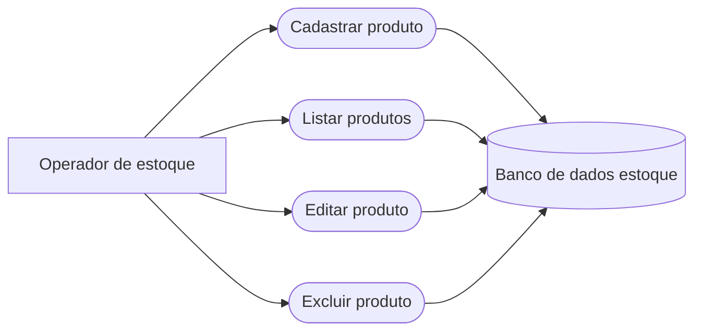

# Sistema de Gestão de Estoque

Aplicação web em PHP e MySQL para controlar os produtos disponíveis no estoque de um mercado. O sistema permite cadastrar, consultar, editar e excluir produtos.

## Tecnologias

- PHP
- MySQL
- HTML
- Git e GitHub para versionamento do projeto

## Requisitos

- Windows com [XAMPP](https://www.apachefriends.org/pt_br/index.html) instalado, ou ambiente equivalente com PHP e MySQL/MariaDB.
- Apache e MySQL em execução.
- Navegador web.

## Instalação e configuração

1. Coloque ou clone o projeto dentro da pasta `htdocs` do XAMPP. Por exemplo: `C:\xampp\htdocs\lucas_pedroso_m1_2026\crud_estoque`.
2. Inicie os serviços **Apache** e **MySQL** pelo painel do XAMPP.
3. Abra o phpMyAdmin em `http://localhost/phpmyadmin` e importe o arquivo `database/db.sql`. O script cria o banco `estoque` e a tabela `produtos`.
4. Confira os dados de acesso ao banco em `infra/conn.php`. A configuração inicial usa host `localhost`, usuário `root`, senha vazia e banco `estoque`; ajuste esses valores se o seu ambiente for diferente.
5. Acesse o projeto pelo navegador. Com a estrutura de pasta do exemplo, a URL é `http://localhost/lucas_pedroso_m1_2026/crud_estoque/`. Ajuste o caminho conforme o nome da pasta dentro de `htdocs`.

## Banco de dados

O arquivo `database/db.sql` cria o banco `estoque` e a tabela `produtos`:

| Campo | Tipo | Descrição |
| --- | --- | --- |
| `id` | `INT AUTO_INCREMENT PRIMARY KEY` | Identificador único do produto |
| `nome` | `VARCHAR(255) NOT NULL` | Nome do produto |
| `quantidade` | `INT NOT NULL` | Quantidade disponível em estoque |
| `preco` | `DECIMAL(10, 2) NOT NULL` | Preço do produto |
| `data_validade` | `DATE NOT NULL` | Data de validade |
| `categoria` | `VARCHAR(100) NOT NULL` | Categoria do produto |
| `descricao` | `TEXT` | Descrição opcional |

## Funcionalidades

- **Cadastrar:** registra um produto com nome, categoria, descrição, preço, quantidade e data de validade.
- **Listar:** exibe os produtos cadastrados e seus dados na página inicial.
- **Editar:** carrega os dados de um produto para alteração.
- **Excluir:** remove o produto selecionado após confirmação.
- **Persistência:** os registros são armazenados no MySQL.
- **Acesso ao banco:** as instruções com valores fornecidos pelo usuário usam Prepared Statements. A listagem geral usa uma consulta SQL fixa, sem parâmetros recebidos do usuário.
- **Exibição:** os valores textuais apresentados nas telas são escapados com `htmlspecialchars` para reduzir o risco de interpretação de HTML inserido nos dados.

## Estrutura do projeto

```text
crud_estoque/
├── database/
│   └── db.sql             # Criação do banco e da tabela
├── infra/
│   └── conn.php           # Configuração da conexão MySQL
├── public/
│   ├── atualizar.php      # Processa alterações de produtos
│   ├── cadastrar.php      # Processa novos cadastros
│   ├── editar.php         # Exibe o formulário de edição
│   └── excluir.php        # Processa a exclusão
├── index.php              # Formulário de cadastro e listagem
└── README.md              # Documentação do projeto
```

## Casos de uso

**Ator:** Operador de estoque, responsável por manter o cadastro de produtos.

| Caso de uso | Ação |
| --- | --- |
| Cadastrar produto | Preencher os dados do produto e enviar o formulário de cadastro. |
| Listar produtos | Consultar os produtos exibidos na página inicial. |
| Editar produto | Selecionar um produto, alterar seus dados e salvar as mudanças. |
| Excluir produto | Selecionar um produto e confirmar a exclusão. |



## Versionamento

O histórico do Git deve registrar a evolução do projeto em commits menores e com mensagens claras. Exemplos de etapas que podem ser registradas:

- `Criação da estrutura inicial do projeto`
- `Criação do banco de dados de produtos`
- `Implementação do cadastro e listagem de produtos`
- `Implementação de edição e exclusão de produtos`
- `Documentação do projeto`

Publique o repositório no GitHub e informe o link público na entrega da atividade. Os exemplos acima são sugestões de mensagens; o histórico deve refletir as alterações realmente realizadas.